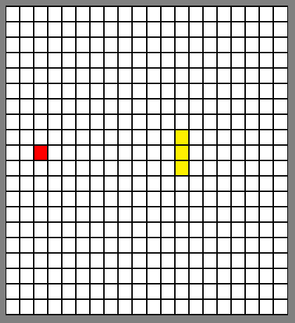

# Snake

@2019
Clásico juego de la serpiente en javascript con jquery.

## Screenshots



## Ejecutar
No se necesita ningún servidor para ejecutar el juego, solo abrir el archivo `index.html` en el navegador.\
Sin embargo, si se desea ejecutar con un servidor, se puede utilizar el siguiente comando:

```bash
# Con php
php -S localhost:8000

# O con python
python -m http.server 8000
```

## Jugar

```text
Arriba: ↑
Abajo: ↓
Izquierda: ←
Derecha: →
```